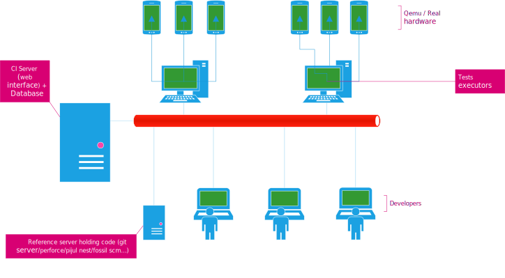

# Architecture

At its core, the CI architecture is quite basic and similar to many other solution in this space.

It is best viewed as in the following graphical representation:

The CI system comprises of two parts, a database accessible through a web interface, where users can post
requests for builds or view the status of currently running, pending, or finished jobs and tests runners.
Test runners are simple machines that will query the database to see if there are pending tasks they can
execute. In such case, they will pick one, execute it and report into the database the task output as it happens.

In the current system, the runners poll the database instead of having the CI keep track of which machine
is busy or idling and automatically push a task request to a test runner. This surely is less efficient as
having the web server keeping track of the workers, knowing which worker can execute which tasks, which one
is busy at the moment, etc and let the web server schedule tasks on the worker themselves. However, the
polling method is the simplest design to implement.

Test runners might be able to execute any possible task or only a subset. For example a task runner might have
qemu installed on it but no real hardware connected to it. This task runner can therefore execute tasks
requiring tests to be executed only on qemu.

When requesting a tasks, a test runner will thus tell its capabilities to ensure it receives a task it can
actually perform.
