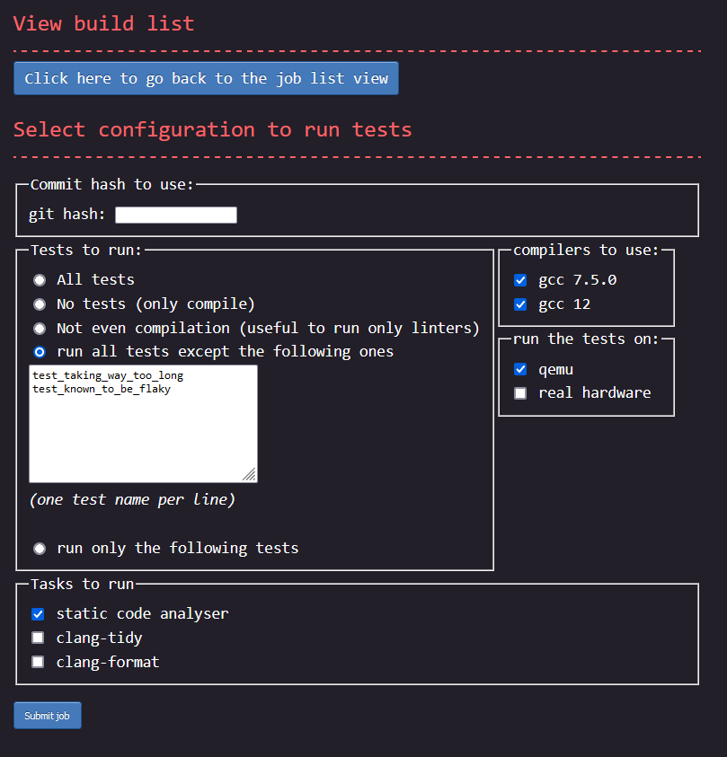

# Implementation of the CI web server

## User interface

One of the goal was that the project needed to be dead simple to use. Everything had to be self explanatory.
Below are screenshots of the three pages a user will interact with. You can decide by yourself if everything
looks clear or not. Note: for best view, right click on the images and open them in a new tab.

The main page:


The page to add a new job:



Page showing the details of a requested build:


I can't get credit for the `CSS` though. I took it from the [terminimal theme from the zola blocg
engine](https://www.getzola.org/themes/zola-theme-terminimal/)

## Strict conformance to web standard

Special care was taken during the development to ensure that the web pages are 100% compliant with the [w3c
validator](https://validator.w3.org/#validate_by_input+with_options). Both the `HTML` and the `CSS` report no
errors. The `CSS` does report warnings with these validator. As a consequence, the website is 100% functional
using terminal based web browsers such as `lynx` or `w3m`.

Something to note, in order to achieve this 100% conformance, the output of the tasks had to be sanitised since
not all valid utf-8 sequences are accepted by the `HTML` specification. As such, the data reported on the `HTML`
might not always correspond 100% to what is saved in the database. For example, the shell control character
`escape` is displayed in the html page as `\u{1b}`

The `html` are also all self-sufficient. They do not load external resources. Therefore, saving a page locally
to be displayed later on, even without network connectivity is trivial.

## Easy data extraction

One requirement was to make it easy for a developer to extract only some data.  One way would be to simply
query an SQL request against the database, but since the choice was made to use `sqlite`, the database doesn't
process network request. Instead, each of the cells on the html containing interesting data are selectable
with a CSS path. To extract the CSS path of a specific element, for example the status of the `ubsan_test`,
compiled with gcc from distro and executed on qemu, a user would:

1. open the build page on firefox
2. open the developer tool
3. select that element
4. right click
5. click `copy >> CSS Path`

Then to programmatically retrieve the status of the ubsan test of any build, a developer would only need to
execute the following command:
```sh
wget -q -O - 'http://address_of_ci_server/build/<a_build_id>' | \
  htmlq --text '<the css path copied from firefox with only a slight manual tweak>'
```

The CSS path need to be slightly manually tweaked since the one Firefox returns isn't specifying enough in
some places and too much in others. For the given example, Firefox would return `html body div.Failed table
tbody tr td.Failed details summary`. The two `.Failed` here would need to be removed, and a few elements need
to be enhanced with the correct title. The correct CSS path is: `html body div[title="Tests_gcc_from_distro"]
table tbody tr[title="ubsan_test"] td[title="Qemu"] details summary` The title's value can be found in the html
tags. Once the correct path is extracted, a developer can reuse that same command, only changing the build
id. Getting the logs of the test instead of the status can be done the same way. Same for any other test.

## Database choice

One of the goal of the project was to remain as simple to tweak as possible. Another goal is
performance. These two are often at odds. Most of the time I favoured keeping things simple and easy to
maintain over achieving extra performance. At least for a first shot.

For the database I went for `sqlite` for the reason of simplicity. It doesn't require user
accounts. Everything is in a single file making it also trivial to backup shall the need arise.  Admittedly,
`sqlite` is not the best choice here from a performance point of view, and as per `sqlite`'s authors own
statement, my use case is not one for which `sqlite` is a good fit. Still, simplicity trumped performances in
my case, ... for now.

If I would have to chose another database, it would have been `postgresql` since it is well-maintained and has
lots of documentation. Otherwise, the option of creating my own data structures and serialising/deserialing
them to/from disk would also have been an option, but that would have gone against the goal of keeping things
easy to tweak.

One unfortunate consequence of using `sqlite` though is that it isn't accessible from the
network. Consequently the webserver provides some endpoints whose sole purposes is to act as a proxy to the
database. This is how for example workers end up updating the database with the test execution output: through
a POST method to the web server.

## Language choice

For the choice of the programming language, the main criteria was performance in terms of execution speed.
Memory consumption isn't as much of a concern, but due to CPU caches and TLB misses, there is also a high
correlation between lower memory usage and increased performance. On top of that, execution time need to be
consistent to avoid issues of intermittent high latency waved away as being "just a fluke", "just a one-time
thing" instead of getting analysed.  This means that languages relying on a garbage collector are
out-of-question. Having consistent execution time also makes it possible to set short timeouts to detect when
a task is taking too long and is likely stuck.

In the end, the choice was between `assembly`, `C`, `C++`, and `Rust`. I didn't consider `Zig` at the time but
it seems to fit the performance criteria like the others. I ended up picking `Rust` since it seems to be easiest
to maintain in the long term than the alternatives.

## Web server choice

For the web server, once the language was decided, the main criteria was performance, especially latency.
Throughput itself was actually given a very low position as a decision criteria as I wasn't expecting for even
10 req/s. The second criteria was to know if the webserver was wel documented, easy to use, well-maintained
with a big team behind it. This was important to avoid betting on a project with a very low bus factor with a
risk of being abandonned while I'm using it.

The choice was between `axum`, `actix-web` and `rocket`. `Rocket` had my favour as it looked to be the easiest
to use but it also had a very low bus factor at the time I made my decision. I deemed it too risky a
choice. Between `axum` and `actix-web`, I decided to go for `axum` as it looked to be the safest choice in
term of maintainance in the future and seemed to score better in latencies benchmarks.
